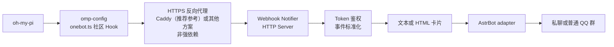

# AstrBot Webhook Notifier

接收由 [`omp-config` onebot post hook](https://github.com/ParticleG/omp-config/blob/main/agent/hooks/post/onebot.ts) 发送的 oh-my-pi 会话结束通知，并向 AstrBot 私聊或普通 QQ 群发送纯文本通知或 HTML 图片卡片。

[](https://github.com/AsterleedsGuild0/astrbot_plugin_webhook_notifier/releases) [](LICENSE) [](pyproject.toml) [](https://docs.astrbot.app/)

OMP 原生提供 extension / hook 加载机制和 `session_stop` 生命周期事件；HTTP Webhook 发送、环境变量与 version 1 payload 由上述社区 hook 实现，并非 OMP 内建 Webhook。本插件支持 OMP 与 OpenCode 两种 provider；OpenCode 使用 V1 file Plugin 产生安全的四事件 envelope。

**版本状态：** `v1.0.0` 是现有稳定版；当前源码与本地测试包是尚未发布的 `v1.1.0-rc.1` 候选。Provider Registry、OpenCode Server Adapter、OpenCode V1 Client Plugin 及其 smoke 仅应使用该候选或后续版本，不应归入 `v1.0.0` 资产。发布与安装边界见[公共契约](docs/public-contract.md)和[发布流程](docs/release.md)。

<!-- 脱敏截图待补充：。需隐藏 Token、完整 Webhook URL、Endpoint Path 随机段、账号、群号、服务器地址与消息隐私。 -->

<!-- 脱敏截图待补充：。需隐藏 Base URL、部署地址、账号信息与模板中的业务敏感数据。 -->

---

## 功能亮点

- 兼容社区 onebot post hook 产生的 `omp.session_stop` payload，展示会话、工作目录、模型、耗时与输入规模等常用信息。
- `v1.1.0-rc.1` 候选支持 OpenCode V1 file Plugin，将 `session_idle`、`session_error`、`permission_asked` 与 `question_asked` 转换为匿名、白名单 envelope。
- 支持纯文本与 HTML 图片卡片两种全局渲染模式。
- HTML 渲染或图片发送异常时，可自动降级为纯文本通知。
- 通过聊天命令为个人私聊或普通 QQ 群创建、轮换、撤销和删除 endpoint。
- Endpoint Path 与 Token 分开交付，聊天消息不会返回完整 Webhook URL。
- 在认证后的 Plugin Page 中预览、复制、编辑、保存、应用和删除自定义 HTML 模板。
- 为每次请求返回可观察的投递、跳过、降级与重试信息，便于调用方判断结果。

## 完整使用流程



1. 安装并重载 Webhook Notifier 插件。
2. 配置 HTTP 监听地址、端口与 `public_base_url`；同机或可信内网可直接访问。
3. 跨主机或公网接入时，按需部署 HTTPS 反向代理；Caddy 是推荐参考，也可使用其他方案。
4. 通过聊天命令创建私聊或普通 QQ 群 Endpoint，分别保存 Base URL、Endpoint Path 与 Token。
5. 使用 `curl` 验证 URL、Token 鉴权和实际投递或跳过结果。
6. 部署社区 onebot post hook，并配置 `OMP_SESSION_WEBHOOK_URL` 与 `OMP_SESSION_WEBHOOK_TOKEN`。
7. 触发真实 oh-my-pi 会话结束事件，确认目标私聊或普通 QQ 群收到通知。

**完整教程：** 请阅读[端到端部署](docs/end-to-end-setup.md)，其中集中说明 Caddy HTTPS 反代与社区 Hook 的完整配置，README 不重复展开运维细节。

---

## 快速开始

### 1. 安装插件

> `v1.0.0` 已发布；当前 OpenCode 功能请使用尚未发布的 `v1.1.0-rc.1` 候选或后续版本。市场搜索、文件安装和源码安装的实际可用性仍取决于 AstrBot 运行环境。

| 方式 | 操作 |
| --- | --- |
| Release ZIP（推荐） | 从 `v1.0.0` Release 下载 `astrbot_plugin_webhook_notifier-v1.0.0.zip`，在 WebUI 选择“从文件安装” |
| `v1.1.0-rc.1` 本地测试 ZIP | 使用 `dist/astrbot_plugin_webhook_notifier-v1.1.0-rc.1.zip` 在 AstrBot WebUI 手动安装；安装、Bot Endpoint 与 Desktop 端到端 smoke 尚待本 RC 包验证 |
| 已发布资产核对 | 在 Releases 页面核对 `v1.0.0` 正式资产；`v1.0.0-rc.1` 仅用于历史候选版回溯 |
| WebUI 仓库 URL | 在 URL 安装入口填写 `https://github.com/AsterleedsGuild0/astrbot_plugin_webhook_notifier` |
| 源码安装 | 将仓库克隆到 `AstrBot/data/plugins`，见下方命令 |

后两种方式同样不是官方插件市场搜索安装。源码安装命令：

```bash
git clone https://github.com/AsterleedsGuild0/astrbot_plugin_webhook_notifier.git \
  AstrBot/data/plugins/astrbot_plugin_webhook_notifier
```

安装后在 WebUI 中加载或重载插件。运行环境需要 Python >= 3.10。

### 2. 完成最小配置

进入 **AstrBot WebUI → 插件管理 → Webhook Notifier → 配置**：

- 保持 `enabled: true`；默认文本模式无需额外配置。
- 按部署方式配置 `server.host`、`server.port` 和包含 Webhook base path 的 `server.public_base_url`：同机或可信内网可直连，跨主机或公网建议通过 Caddy 等反向代理提供 HTTPS；不要公开真实值。
- 本节使用私聊 endpoint 验证。只有在确认平台主动消息规则和风险后，才将 `enable_private_notifications` 设为 `true`，然后重载插件。

### 3. 创建第一个私聊 endpoint

```text
<唤醒词>whn token new private demo
```

AstrBot 默认唤醒词为 `/`，因此默认命令是 `/whn token new private demo`。创建成功后，聊天返回 `Endpoint Path`，并在独立消息中交付一次 Token；不会返回完整 URL。请在认证后的插件详情 **Plugin Page** 复制 Base URL。

### 4. 模拟 onebot post hook 请求

先把三个值分别写入环境变量，不要把 Token 放进 URL：

```bash
export WHN_BASE_URL='<从认证 Plugin Page 复制>'
export WHN_ENDPOINT_PATH='<聊天返回的 Endpoint Path>'
export WHN_TOKEN='<聊天单独返回的 Token>'

curl --fail-with-body --silent --show-error \
  -X POST "${WHN_BASE_URL}/${WHN_ENDPOINT_PATH}" \
  -H 'Content-Type: application/json' \
  -H 'X-OMP-Event: session_stop' \
  -H "Authorization: Bearer ${WHN_TOKEN}" \
  --data-binary @- <<'JSON'
{
  "event": "omp.session_stop",
  "version": 1,
  "emittedAt": "2026-07-20T12:00:00Z",
  "session": {"name": "README smoke test", "model": "provider/model"},
  "round": {"turnId": "demo-1", "durationMs": 1200}
}
JSON
```

预期结果：

- 私聊通知已开启时，HTTP 返回 200、`code: 0`、`message: "ok"`，Bot 私聊收到一条文本或图片通知。
- 私聊通知保持默认关闭时，HTTP 仍返回 200，但 `message: "skipped"`，聊天不会收到通知；这是安全策略结果，不应重试。
- 使用 `html_image` 且发生渲染问题时，默认会回退为文本，并在 HTTP 响应中给出降级原因。

### 接入自动通知

端到端部署见[专题教程](docs/end-to-end-setup.md)，[客户端接入文档](docs/client-integration.md)包含 `onebot.ts` 的 OMP 用户级/项目级目录、进程环境变量、加载验证和 `session_stop` 触发方法。从上游部署 onebot post hook 后，为其配置完整 URL 变量 `OMP_SESSION_WEBHOOK_URL` 和 Token 变量 `OMP_SESSION_WEBHOOK_TOKEN`。

`ParticleG/omp-config` 是独立维护的社区仓库，当前未明确 LICENSE；本项目仅链接上游源文件，不复制或分发其代码，也不代表该 hook 由本项目或 OMP 官方维护。

### OpenCode 快速接入

1. 先构建并安装包含 OpenCode provider 的 Webhook Notifier 测试包，然后在 AstrBot 中重载插件；未部署新服务端版本时，旧插件无法创建或处理 OpenCode Endpoint。
2. 在 AstrBot 私聊创建 OpenCode Endpoint：`<唤醒词>whn token new private <名称> --provider opencode`。
3. 分别保存 Plugin Page 的 Base URL、聊天返回的 Endpoint Path 和单独交付的 Bearer Token，并在受控环境中组成客户端所需的完整 Endpoint URL。
4. 将 `integrations/opencode/webhook-notifier.ts` 放到运行 OpenCode 的机器，复制 `integrations/opencode/opencode.jsonc` 的 V1 `plugin` tuple，并用 `{env:...}` 或 `{file:...}` 提供 URL/Token。`actionContentMode` 默认 `strict`；只有明确接受业务文本/目标路径泄露风险时才设置为 `summary` 或 `full`。
5. 服务端升级并重载后再部署新版 Client；完全重启 OpenCode Desktop 或 CLI 进程，再触发完成、失败和权限请求事件并核对 Bot 通知。旧服务端严格 allowlist 不接受新 `session.scope`。

`python scripts/smoke_opencode_plugin.py --cli` 只验证 OpenCode CLI 会实际调用 V1 Plugin server，不能替代 AstrBot 测试包部署、Endpoint 创建和 Bot 端到端通知验收。完整流程见[OpenCode 集成指南](docs/opencode-integration.md)。

---

## 支持范围

平台声明表示对应路径已验证，不代表平台允许无限制主动发送消息。

| 平台 / 场景 | 状态 | 当前边界 |
| --- | --- | --- |
| `aiocqhttp` | 已验证 | 命令、普通 QQ 群通知与 HTML 图片卡片 |
| `qq_official` WebSocket 私聊 | 已验证 | 私聊命令、Webhook 鉴权、主动通知与 OMP 图片卡片 |
| `qq_official` WebSocket 普通 QQ 群 | 已验证 | 群验证、主动 Webhook 与 OMP HTML 图片卡片 |
| `qq_official` WebSocket QQ 频道（Guild） | 不支持，无计划 | 当前身份与群验证流程不覆盖 QQ 频道 |
| `qq_official_webhook` | 不支持，无计划 | 未在插件元数据中声明，也未适配该接入方式 |

Webhook 私聊主动通知默认关闭；开启前请阅读[平台投递策略](docs/platform-delivery-policy.md)，群聊通知不受此开关影响。

---

## 常用命令

文档统一使用 `<唤醒词>`；默认值为 `/`。完整说明见[命令参考](docs/command-reference.md)，管理员命令不在首页展开。

| 场景 | 命令 |
| --- | --- |
| 查看帮助 | `<唤醒词>whn help` |
| 创建私聊 endpoint | `<唤醒词>whn token new private [名称]` |
| 申请群聊 endpoint | `aiocqhttp: <唤醒词>whn token new group <数字群号> [名称]`；`qq_official: <唤醒词>whn token new group current [名称]` |
| 查看自己的 endpoint | `<唤醒词>whn token list` |
| 轮换 Token | `<唤醒词>whn token rotate <名称>` |
| 撤销 endpoint | `<唤醒词>whn token revoke <名称>` |
| 永久删除终态 endpoint | `<唤醒词>whn token delete <名称>` |

---

## 配置摘要

| 配置 | 默认值 | 作用 |
| --- | --- | --- |
| `enabled` | `true` | 启用插件；创建可投递 endpoint 后自动启动 HTTP 服务 |
| `render_mode` | `text` | 选择 `text` 或 `html_image` 以使用纯文本或是HTML渲染模式 |
| `notification_mode` | `focused` | `focused` 仅抑制成功完成的 subagent；`all` 发送全部通知 |
| `enable_private_notifications` | `false` | 是否允许 Webhook 主动投递到私聊目标 |
| `fallback_to_text` | `true` | HTML 图片链路失败时是否降级为文本 |
| `server` | 本地监听 | 配置 `host`、`port`、`base_path`、`public_base_url` 与请求体上限 |

全量字段、默认值和编辑格式以 [`_conf_schema.json`](_conf_schema.json) 为准；部署与运维说明见[安全与运维](docs/security-and-operations.md)。

### HTML 模板与 Base URL

在 AstrBot 插件详情页打开 Plugin Page，可以查看只读内置模板，或创建副本后编辑、预览、保存、应用和删除自定义模板。模板变量与示例见 [HTML 模板变量](docs/template-variables.md)。

同一页面提供认证后的 Base URL 复制入口。调用方应将它与聊天返回的 `Endpoint Path` 组合；Base URL、Endpoint Path 和 Token 应分别保存，避免凭据随完整 URL 泄露。

---

## 安全提示

- 公网接收 Webhook 时使用 HTTPS，并优先让 HTTP 服务监听本地地址、由反向代理转发。
- Token 只放在 `Authorization` Header 的 `Bearer <token>` 中；泄露后立即执行 `token rotate`。
- 私聊主动通知默认关闭；开启前核对 QQ 官方规则或 OneBot 实现的风控边界。
- 社区 hook 可能发送截断 prompt、cwd、session 文件、模型和消息计数等元数据；部署前评估数据外发边界，提交 Issue、日志或截图时一并脱敏。
- OpenCode 通知默认只发送 action 类别/计数；`full` 内容模式是显式 opt-in，虽有字段白名单和大小上限，仍可能外发问题、权限描述或目标路径。
- `actionContentMode` 只控制 OpenCode Question/Permission 内容隐私，与服务端 `notification_mode` 正交；`focused` 只抑制成功完成的 subagent，unknown 会 fail-open 放行。
- OpenCode Client 只发送匿名 `session.ref` 与 `session.scope`，不发送 `parentID`；部署必须服务端先升级、OpenCode Client 后重启。
- adapter 实例的 `platform_id` 发生变化时，不要直接编辑数据文件，按 [rebind runbook](docs/platform-id-rebind-runbook.md) 离线处理。

更多说明见[安全与运维](docs/security-and-operations.md)和[平台投递策略](docs/platform-delivery-policy.md)。

---

## 文档索引

- [公共契约与 1.x 兼容政策](docs/public-contract.md)
- [命令参考](docs/command-reference.md)
- [端到端部署](docs/end-to-end-setup.md)
- [客户端接入](docs/client-integration.md)
- [OpenCode 集成](docs/opencode-integration.md)
- [安全与运维](docs/security-and-operations.md)
- [平台投递策略](docs/platform-delivery-policy.md)
- [HTML 模板变量](docs/template-variables.md)
- [`platform_id` rebind runbook](docs/platform-id-rebind-runbook.md)
- [发布流程](docs/release.md)
- [CHANGELOG](CHANGELOG.md)
- [PRD](docs/PRD.md)（面向贡献者）
- [FSD](docs/FSD.md)（面向贡献者）

---

## FAQ

### 这是 OMP 原生 Webhook 吗？

不是。OMP 提供 hook 机制和 `session_stop` 事件，HTTP 请求与 version 1 payload 来自独立维护的社区 onebot post hook；本插件兼容其请求格式。

### OpenCode provider 如何启用？

创建 Endpoint 时追加 `--provider opencode`；不追加时默认 `omp`。provider 在创建后不可变，OpenCode Plugin 配置和排障见[OpenCode 集成指南](docs/opencode-integration.md)。

### 私聊 endpoint 创建成功，为什么没有通知？

`enable_private_notifications` 默认是 `false`。此时请求会返回 HTTP 200 和 `message: "skipped"`；确认平台规则与风险后开启配置并重载插件。

### HTML 图片失败后怎么办？

保持 `fallback_to_text: true`，插件会尝试回退文本。再检查 AstrBot `html_render` / T2I 服务、模板内容和响应中的 `fallback_reason`；截图裁剪与渲染排查见 [`docs/t2i-rendering-notes.md`](docs/t2i-rendering-notes.md)。

---

## 反馈与 License

发现缺陷或文档问题，请提交 [GitHub Issue](https://github.com/AsterleedsGuild0/astrbot_plugin_webhook_notifier/issues)。公开反馈中请勿附带真实 Token、完整 Webhook URL 或未经脱敏的日志与截图。本项目采用 [MIT License](LICENSE)。
