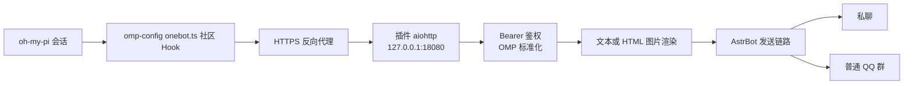

# 从 AstrBot 到 OMP 的端到端部署教程

## 文档信息

- 适用插件版本：v0.3.0 及后续保持兼容的版本
- 验证日期：2026-07-20
- 目标读者：首次部署 Webhook Notifier，并希望把 oh-my-pi 会话结束通知发送到 AstrBot 私聊或普通 QQ 群的管理员
- 反向代理说明：本文使用 Caddy 作为参考实现；Nginx、Traefik 或其他能够保留请求路径并提供 HTTPS 的反向代理均可替代

本文从 AstrBot 服务器配置开始，依次完成 Endpoint 创建、HTTPS 反向代理、请求模拟、社区 Hook 配置和真实 `session_stop` 验收。示例只使用保留域名和占位符；真实 URL、Endpoint Path、Token、群标识及日志只能在受控环境中处理。

---

## 架构与职责



职责边界如下：

- oh-my-pi（OMP）提供 extension、Hook 加载机制和 `session_stop` 生命周期事件。
- [`ParticleG/omp-config` 的 `agent/hooks/post/onebot.ts`](https://github.com/ParticleG/omp-config/blob/main/agent/hooks/post/onebot.ts) 是独立维护的社区 Hook，负责把事件转换为 HTTP POST；它不是 OMP 原生 Webhook。
- HTTPS 反向代理负责公网入口、TLS 和访问日志，不负责插件 Token 鉴权。
- Webhook Notifier 负责 Endpoint 查找、Bearer 鉴权、OMP version 1 payload 标准化、渲染和 AstrBot 投递。
- AstrBot adapter 负责把通知送往 Endpoint 已绑定的私聊或普通 QQ 群；外部 payload 不能指定任意目标。

---

## 选择部署场景

### 同机或受控内网直连

OMP 与 AstrBot 在同一主机时，可以直接访问 `http://127.0.0.1:18080`。在严格受控的内网中也可以直接使用 HTTP，但插件必须只绑定受控接口，网络访问必须受防火墙或等效策略限制。无论是否使用 HTTPS，都必须配置独立 Bearer Token。

直连适合一次性验证或可信网络，不应把 `127.0.0.1` Base URL 误认为其他主机可以访问的地址。

### 跨主机或公网访问

跨主机或公网调用推荐使用 Caddy 与 HTTPS。Caddy 和 AstrBot 在同一主机时，插件保持默认 `127.0.0.1:18080`，只由 Caddy 访问该端口。

Caddy 与 AstrBot 不同机时，插件不能继续只监听 loopback；应绑定 AstrBot 主机的受控私网接口，并用主机防火墙只允许 Caddy 主机访问该端口。不要把插件绑定到 `0.0.0.0` 后直接向公网开放 `18080`。

---

## 前置条件

开始前确认：

- AstrBot 已运行，Webhook Notifier 插件版本为 v0.3.0 或后续兼容版本。
- 已有可用的私聊或普通 QQ 群 adapter，并了解对应平台的主动消息规则。
- 公网部署已有真实 DNS 域名，域名解析指向反向代理入口。
- 公网入口允许 TCP `80`、`443`；插件端口 `18080` 不直接暴露公网。
- 已安装 Caddy 或其他反向代理；Caddy 只是参考实现，不是必需依赖。
- 已有可加载 extension/Hook 的 OMP 环境。
- 已按上游方式取得并部署 `ParticleG/omp-config` 的社区 `onebot.ts` Hook。

这里的 HTTP POST 能力来自社区 Hook，不是 OMP 原生 Webhook。不要把上游 Hook 源码复制到本项目文档或插件中；生产环境应记录实际使用的上游 commit，并自行确认许可和兼容性。

---

## 配置 Webhook Notifier

在 AstrBot WebUI 的插件配置中保持 `enabled: true`。`server` 字段是 JSON 配置，不是 YAML；当前默认值为：

```json
{
  "host": "127.0.0.1",
  "port": 18080,
  "base_path": "/webhook",
  "public_base_url": "",
  "body_limit_bytes": 262144
}
```

字段含义：

- `host`：插件 aiohttp 的监听地址；默认仅本机可访问。
- `port`：插件监听端口，默认 `18080`。
- `base_path`：服务端路由前缀，默认 `/webhook`。插件在该前缀后读取 Endpoint Path。
- `public_base_url`：外部调用方可访问、并且已经包含 `base_path` 的 Base URL，例如 `https://hooks.example.invalid/webhook`。Plugin Page 不会再次自动追加 `base_path`。
- `body_limit_bytes`：请求体上限，默认 `262144` 字节（256 KiB）。

公网部署的配置示意：

```json
{
  "host": "127.0.0.1",
  "port": 18080,
  "base_path": "/webhook",
  "public_base_url": "https://hooks.example.invalid/webhook",
  "body_limit_bytes": 262144
}
```

`example.invalid` 是保留占位域名，不能用于真实 TLS 签发。请只在受控配置中替换为真实域名，不要把真实值贴到公开 Issue。

其他重要默认值：

- `render_mode` 的实际默认值是 `text`。
- `enable_private_notifications` 的实际默认值是 `false`；私聊 Endpoint 可以创建和鉴权，但通知会返回 `skipped`，直至管理员在评估平台风险后显式开启并重载插件。

---

## 配置 Caddy HTTPS 入口

当 Caddy 与 AstrBot 在同一主机时，可使用以下通用配置：

```caddyfile
hooks.example.invalid {
    reverse_proxy 127.0.0.1:18080
}
```

该配置会把原始请求路径完整转发给插件，因此外部的 `/webhook/u/...` 仍以相同路径到达 aiohttp。不要使用会剥离匹配前缀的 `handle_path /webhook/*`，除非已经显式配置并验证了正确的路径重写；前缀被剥离会导致 Endpoint 路由不匹配。

Caddy 自动 TLS 需要真实、可解析且满足签发条件的 DNS 域名。`hooks.example.invalid` 只能作为公开示例，不能获得真实证书。

网络最小暴露原则：

- 公网只开放 `80`、`443`，不直接开放插件端口 `18080`。
- Caddy 与 AstrBot 同机时，插件保持 loopback 监听。
- Caddy 与 AstrBot 不同机时，把 `reverse_proxy` 上游改为 AstrBot 的受控私网地址，并在防火墙中只允许 Caddy 主机访问。
- 反向代理访问日志可能包含 Endpoint Path。应限制日志读取权限，对导出内容脱敏，并设置符合组织要求的保留期。

重载 Caddy 后，先确认 DNS 与 TLS 正常，再继续 Endpoint 验证。不要通过公开截图展示真实域名、上游私网地址或完整访问日志。

---

## 创建 Endpoint 并分离保管凭据

所有创建申请都从与 Bot 的私聊开始。私聊通知 Endpoint 的最短命令为：

```text
<唤醒词>whn token new private demo
```

普通 QQ 群需要额外的群验证流程；`aiocqhttp` 与 `qq_official` 的命令和确认步骤不同，请严格按[命令参考](command-reference.md)执行。

成功后分别取得：

1. **Base URL**：从已认证的 AstrBot Plugin Page 复制，例如 `https://hooks.example.invalid/webhook`。
2. **Endpoint Path**：聊天安全摘要返回，形如 `u/<OWNER_HASH>/<ENDPOINT_NAME>`。
3. **Bearer Token**：创建、确认或轮换成功后，通过独立私聊消息只交付一次。

三者必须分开保管。最终 URL 的组成仅作结构示意：

```text
Base URL:     https://hooks.example.invalid/webhook
Endpoint Path: u/<OWNER_HASH>/<ENDPOINT_NAME>
完整 URL:     https://hooks.example.invalid/webhook/u/<OWNER_HASH>/<ENDPOINT_NAME>
Token:        <独立保存，不放入 URL>
```

只在受控环境中组合真实值。不要在聊天转发、shell history、截图、工单或公开 Issue 中同时出现完整 URL 与 Token。

---

## 分阶段验证服务端链路

### 1. 检查插件状态与 HTTP 服务

在聊天中执行：

```text
<唤醒词>whn status
```

确认插件已启用、HTTP 服务正在运行、监听地址与端口符合部署设计，并且至少存在一个可投递 Endpoint。HTTP 服务会在存在可投递 Endpoint 后启动；只有 pending 或尚未领取 Token 的记录时，不能完成正常鉴权投递。

### 2. 使用 README 的 curl 模拟社区 Hook

按[项目 README 的 curl 示例](../README.md)分别设置 Base URL、Endpoint Path 和 Token，再发送 `omp.session_stop` version 1 JSON。先完成这一阶段，避免同时排查代理、Token、Hook 加载和 OMP 生命周期。

响应含义：

- `message=ok`：至少一个目标成功投递。
- `message=skipped`：请求已鉴权和处理，但目标被安全策略跳过；常见原因是私聊通知默认关闭，不应重试。
- `message=partial_delivery`：部分目标成功，部分目标被跳过；查看脱敏后的逐目标结果。
- `401`：通常是 Bearer Token 缺失、格式错误或已经轮换失效。
- `403`：Endpoint 可能被撤销、禁用，或群 Endpoint 尚未领取 Token。
- `404`：通常是 Endpoint Path 不存在，或反向代理与 `base_path` 的路径组合错误。

若 `html_image` 渲染失败且 `fallback_to_text=true`，插件会尝试回退为文本；响应中的 `requested_render_mode`、`render_mode` 和 `fallback_reason` 可用于判断是否发生降级。

### 3. 再部署真实社区 Hook

只有 curl 已经成功或得到预期的 `skipped` 后，才继续配置 OMP Hook。这样可以把后续问题限定在 Hook 加载、环境变量、网络和 timeout 范围内。

---

## 配置 OMP 社区 Hook

完整命令、显式注册、日志位置和排障步骤见[OMP 客户端社区 Hook 集成指南](client-integration.md)。本阶段只按以下顺序执行：

1. 从 [`ParticleG/omp-config` 上游 `onebot.ts`](https://github.com/ParticleG/omp-config/blob/main/agent/hooks/post/onebot.ts)取得脚本前确认有权使用；本仓库不分发脚本，且不提供 raw 下载步骤。
2. 二选一放入用户级 `~/.omp/agent/hooks/post/` 或项目级 `.omp/hooks/post/` 自动发现目录，不要同时部署多份。OMP 自带 TypeScript 运行能力，无需安装依赖或手动编译。
3. 在启动 OMP 的进程环境中设置完整 Endpoint URL、创建 Endpoint 时单独返回的 Token 和可选 timeout；不要假设 OMP 自动加载 `.env`。
4. 重启 OMP，并执行 `omp -p '/extensions'` 确认扩展路径中包含 `onebot.ts`。若未加载，按客户端指南检查日志、升级 OMP 或使用显式注册、`--hook` 诊断。
5. 完成一次真实主代理响应以触发 `session_stop`，再按 OMP、反向代理、AstrBot 和 Bot 的顺序检查。任务或子代理会话不会触发该事件。

该 Hook 可能外发 prompt、`cwd`、session file、会话与轮次标识、模型和统计信息。启用前必须评估数据最小化、跨网络传输、接收目标权限以及 OMP、Caddy 和 AstrBot 各层日志留存。

---

## 验收真实会话

启动一次受控 OMP 会话并正常结束，使其触发 `session_stop`。按链路顺序检查：

1. **OMP**：没有 Hook 加载错误；若发送失败，检查 warn 中的错误类型和 timeout，但不要公开完整 URL。
2. **Caddy**：访问日志出现对应 POST 和预期 HTTP 状态；检查时隐藏域名、Endpoint Path、源地址和其他部署标识。
3. **AstrBot**：查看插件脱敏日志中的请求结果、鉴权错误枚举或投递摘要，不复制原始 payload。
4. **Bot**：确认目标私聊或普通 QQ 群收到通知；私聊默认关闭时，确认 HTTP 返回 `skipped` 即可视为策略符合预期。

不要把真实 OMP warn、Caddy 访问日志、AstrBot 完整日志或 payload 直接复制到公开 Issue。公开协作只提供插件版本、错误类型、HTTP 状态码、`message`/`error` 枚举和使用占位符重写的最小复现步骤。

---

## 常见问题排查

| 现象 | 优先检查 | 处理建议 |
| --- | --- | --- |
| DNS 解析失败或 TLS 证书错误 | 域名解析、80/443、防火墙、证书签发条件 | 使用真实域名完成解析；`example.invalid` 不能签发证书 |
| `connection refused` | Caddy 上游地址、插件 HTTP 服务状态、监听接口、主机防火墙 | 同机使用 `127.0.0.1:18080`；跨机使用受控私网地址并仅允许 Caddy 访问 |
| HTTP 404 | Base URL 是否已包含 `/webhook`、Endpoint Path 是否重复或遗漏、代理是否剥离路径 | 保持完整 `/webhook/u/...`；避免未经验证的 `handle_path /webhook/*` |
| 鉴权失败 | `Authorization: Bearer`、Token 是否被轮换、Endpoint 状态 | 从独立变量发送 Token；无法确认旧 Token 时在私聊执行 rotate |
| HTTP 200 `skipped` | 目标是否为私聊、`enable_private_notifications` | 这是默认安全策略，不重试；评估平台风险后再决定是否开启 |
| HTML 图片失败但收到文本 | `render_mode`、`fallback_to_text`、AstrBot T2I/`html_render` | 根据 `fallback_reason` 修复渲染；可先保留文本降级保证通知链路 |
| curl 成功但真实 Hook 没请求 | Hook 文件是否进入 OMP 可发现目录、环境变量是否传入实际进程、`session_stop` 是否触发 | 按上游部署方式重新加载 Hook，并检查 OMP warn |
| Hook 报 timeout | Caddy/AstrBot 响应时间、网络延迟、渲染耗时、超时值 | 先用文本模式验证；按受控网络情况调整毫秒值；注意上游不重试 |
| 升级或迁移后 Endpoint 不可管理 | adapter 实例的 `platform_id` 是否变化 | 不手工改 Registry；按 [platform_id 离线 Rebind Runbook](platform-id-rebind-runbook.md)停服迁移 |

---

## 安全与运维清单

- 公网或跨不可信网络传输必须使用 HTTPS。
- Caddy 与 AstrBot 同机时保持插件 loopback 监听；跨机时只绑定受控私网接口并配置防火墙白名单。
- 不向公网直接开放 `18080`，不依赖“隐藏路径”代替 Token 鉴权。
- 为不同 Endpoint 使用独立 Token；怀疑泄露或交付状态不确定时立即 rotate，并同步更新 OMP 环境。
- 将 Registry 与 `server_secret` 作为同一恢复单元备份；备份不得进入源码仓库、普通日志或公开工单。
- 限制 Caddy 日志权限，对 Endpoint Path 等信息脱敏，并设置合理保留期。
- 记录生产使用的 `omp-config` 上游 commit，不把可变的 `main` 分支链接当作固定发布物。
- 插件、OMP、`omp-config`、反向代理或 adapter 升级后，重新执行状态检查、curl 模拟和真实会话验收。
- 遵守私聊与普通 QQ 群的平台主动消息规则；技术可发送不代表平台允许无限发送。

更完整的 Token、Registry、日志和恢复规则见[安全与运维指南](security-and-operations.md)。

---

## 相关文档

- [项目 README](../README.md)
- [OMP 客户端社区 Hook 集成指南](client-integration.md)
- [安全与运维指南](security-and-operations.md)
- [平台投递策略](platform-delivery-policy.md)
- [命令参考](command-reference.md)
- [platform_id 离线 Rebind Runbook](platform-id-rebind-runbook.md)
- [`ParticleG/omp-config` 上游 `onebot.ts`](https://github.com/ParticleG/omp-config/blob/main/agent/hooks/post/onebot.ts)
